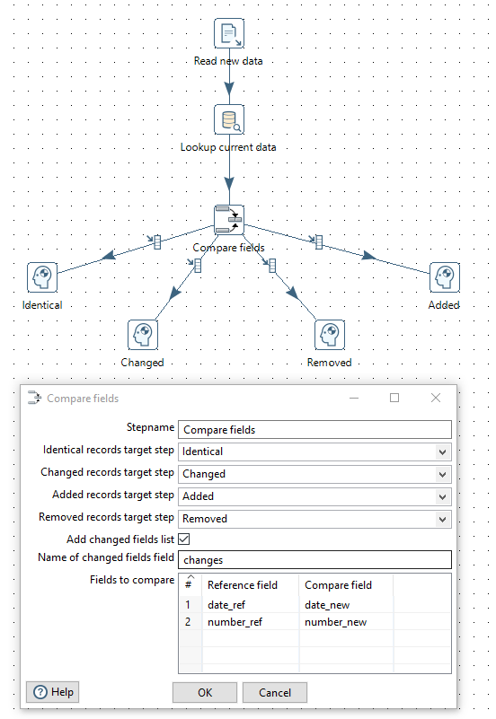

# pentaho-kettle-compare-fields-plugin

Pentaho Data Integration plugin to compare field values in a row.

## Description

This step compares 2 sets of fields in a row and directs it to the appropriate destination step based on the result.
The step detects identical, changed, added and removed rows.

* Identical: no differences
* Changed: at least 1 field is different
* Added: all "Reference" fields are null (if no target step is selected, rows end up in "Changed" target step)
* Removed: all "Compare" fields are null (if no target step is selected, rows end up in "Changed" target step)

An optional field can be specified that will include names of columns where changes were detected
as a comma separated value.  

## How to build 

### Pre-requisites for building the project:
* Maven, version 3+
* Java JDK 1.8
* This [settings.xml](https://raw.githubusercontent.com/pentaho/maven-parent-poms/master/maven-support-files/settings.xml) in your <user-home>/.m2 directory


### Building it

```
$ mvn clean package
```

## Example


